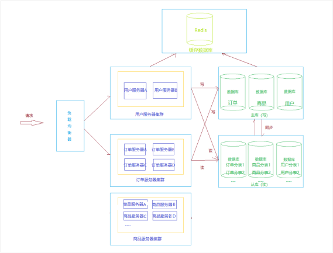

# SpringBoot + SpringCloud 微服务项目

### 项目架构

### 技术栈

#### 1. Eureka

包含 Eureka Server 和 Eureka Client

Eureka Server 提供服务注册服务，配置好各个模块，启动后，会在Eureka Server中进行注册。

这样Eureka Server中的服务注册表中将会存储所有可用服务的节点信息

Eureka Client 是Eureka中的客户端，

#### 2. Zuul

网关，这里使用 Zuul，类似的还可以使用 Gateway 作为网关

每个服务组件会单独运行在一个ip + 端口中。

通过网关处理跨域问题，任何服务模块发起的请求都会请求到网关中

然后通过网关对不同的服务地址进行地址映射

如：

​	前端网页模块：localhost:8088/web

​	用户服务模块：localhost:8088/user

​	通过网关可以进行负载均衡和统一登陆校验等等

注：

​	访问地址需要加上模块名称

​	如：localhost/web/index.html
